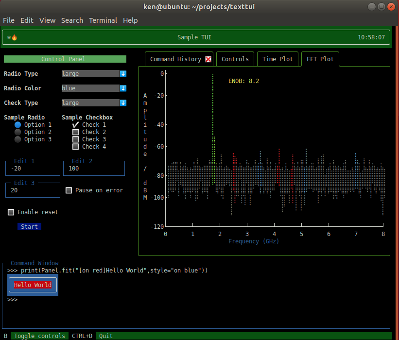

# TextTUI

TextTUI is a set of extensions to the Textual and Textual-Inputs libraries.  Currently a **Work in Progress** that is based on the 0.1.14 branch of Textual.

> **NOTE:** The 0.1.14 branch of Textual is the "early adopter" branch and will eventually be replaced with a "ccs" branch.  At that point, this library will be in-compatible until appropriate updates are made to this repo.

> **DISCLAIMER:** I have been writing C/C++ code since 1986, but Python code only since November, 2021!  I know this project is not packaged in a standard "Python way" ... I am still learning / trying to figure out how to do that.  Take it for what it is.



## Installation

As mentioned in my disclaimer, I am still very new to Python and haven't yet trained myself how to create appropriate packages to specify dependencies or use 'pip install'.  For now, simply install the required dependent packages manually:

```python
pip3 install textual-inputs
```

## Running the example

The example app was tested using Python 3.9 (it probabably works with 3.8 also).  To run the app:

```python
python3.9 sample_tui.py
```

## Structure

The extended Textual widgets, layouts, etc. are in the 'tui' subdirectory (yes, I know, these should be in a 'src' directory eventually).  

    texttui
    |
    +--imgs        Images for the README.md
    |
    +--fft_data    FFT Magnitude data for the FFT Plot tab
    |
    +--tui
       |
       +-- layouts   Extended Textual layouts (control panel)
       |
       +-- views     Extended Textual views (control panel)
       |
       +-- widgets   Extended Textual widgets

## Extended Widgets

The library currently offers the following widgets:

 - Check button
 - CliInput
 - Droplist
 - Dynamic (a widget that posts to it's parent when it is updated)
 - DynamicTable
 - FixedTitleTextInput (a Textual-inputs TextInput extension)
 - HoverButton (changes color when mouse is over it)
 - Label (static)
 - Plot widget
 - Radio button
 - Tab control

## Known Bugs

 - If the console window is not tall enough, the display is garbled until the first resize.
 - If the console window is too narrow for all the Tabs, the rightmost tabs will not be displayed correctly.
 - If emojis are added to the Tab control which are "double wide", the right border doesn't display correctly.
 - The Plot widget annotations can mess up the display if the annotation is on top of rendered graphics.  This bug has been addressed and tested, but there may still be corner cases that still cause issues.


